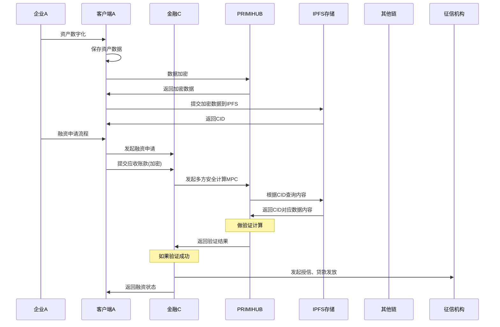

# 业务逻辑梳理

## 金融平台关系展示图

其中有些关键动作是放在智能合约里实现为了在区块链上留下不可修改记录，以方便后期审计的介入。

## 企业AB后台功能菜单

- 用户账户管理
  - 用户注册、登录
  - 账户信息维护
  - 权限分配与角色管理

- 权限与访问控制
  - 角色定义与权限分配
  - 访问日志记录
  - 操作审计跟踪

- 合同管理
  - 合同登记
  - 合同查询

- 应收账款管理
  - 应收账款登记
  - 应收账款查询
- 应付账款管理

  - 应付账款登记
  - 应付账款查询

- 融资申请审批流程
  - 融资申请提交
  - 融资进度跟踪

- 智能合约管理
  - 智能合约部署
  - 智能合约执行
  - 智能合约审核

- IPFS集成
  - 敏感数据加密存储
  - 文件上传至IPFS
  - 文件存储管理
  - 文件检索与验证
  - 数据解密访问控制
  
- 合规性检查
  - 法规遵循性检查
  - 合规性报告生成
  - 监管机构接口

- 平台维护和管理
  - 系统性能监控
  - 交易活动监控
  - 安全事件监控

## 金融机构后台功能菜单

- 用户账户管理
  - 用户注册、登录
  - 账户信息维护
  - 权限分配与角色管理

- 权限与访问控制
  - 角色定义与权限分配
  - 访问日志记录
  - 操作审计跟踪

- 融资申请审批流程
  - 融资申请审核
  - 融资进度跟踪

- 智能合约管理
  - 智能合约部署
  - 智能合约执行
  - 智能合约审核

- 跨链交易支持
  - 跨链资产转移
  - 跨链数据同步
  - 跨链交易验证

- IPFS集成
  - 敏感数据加密存储
  - 文件上传至IPFS
  - 文件存储管理
  - 文件检索与验证
  - 数据解密访问控制

- 平台运维与管理
  - 系统性能监控
  - 交易活动监控
  - 安全事件监控

- 合规性检查
  - 法规遵循性检查
  - 合规性报告生成
  - 监管机构接口

## 企业A的业务流程

### 资产数字化

首页企业上传本企业的应收账款数据到平台，然后通过PrimiHub平台进行加密，加密之后上传到IPFS平台，获得资产的数字化。然后通过智能合约把这个资产进行登记。

* 资产的上传，合同的上传，订单的上传，发票的上传
* 资产的加密，加密并上传到IPFS获得对应的CID。

### 应收款融资

#### 融资申请

根据前面的合同、订单、发票的CIDs，向金融机构进行融资申请。我们通过智能合约向金融机构发起融资申请(上链)。

* 通过智能合约向金融机构发起融资申请（附带：合同，订单和发票的CIDs）

#### 在线确权

确权，就是确认和自己相关的一个应收账款是真实的。这里也是智能合约，自动进行。

#### 确权转让

确权转让，就是让一个确权的应付账款的受益人变成第三方金融机构。

#### 授信计算，设定还款日期

确权转让，就是让一个确权的应付账款的受益人变成第三方金融机构。

#### 获得放款

确权转让，就是让一个确权的应付账款的受益人变成第三方金融机构。

#### 到期还款

确权转让，就是让一个确权的应付账款的受益人变成第三方金融机构。

### 应付款融资

流程同上

## 金融机构的业务流程

### 资金池的管理

在这里扮演资方，对平台进行投资。

#### 增加资金池

#### 降低资金池

### 应付账款融资

#### 融资审核

收到应收账款申请之后，首先向第三方征信机构，获得这个企业的征信。然后再向债务人核心企业去进行确权。债务人进行确权之后。根据征信计算贷款金额，并设定还款日期，然后进行放贷。

#### 确权转让

#### 放款

#### 还款

### 合约管理

选择所使用的合约。

## 智能合约的作用

### 资产数字化合约

#### 应收帐款的数字化

资产上链，并实现账款的流转和抵押融资。

就是将文档上传到IPFS，形成内容寻址链接。

#### 应付账款的数字化

### 双向融资合约

#### 发起应付款融资

#### 授信操作

#### 放款操作

#### 还款操作

### 资金池合约

#### 增加资金池

#### 减少资金池

#### 冻结资金池

