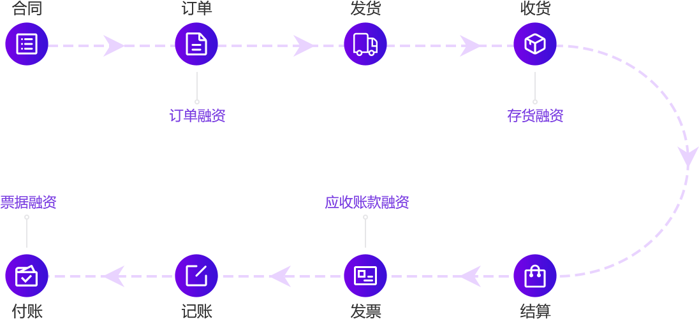
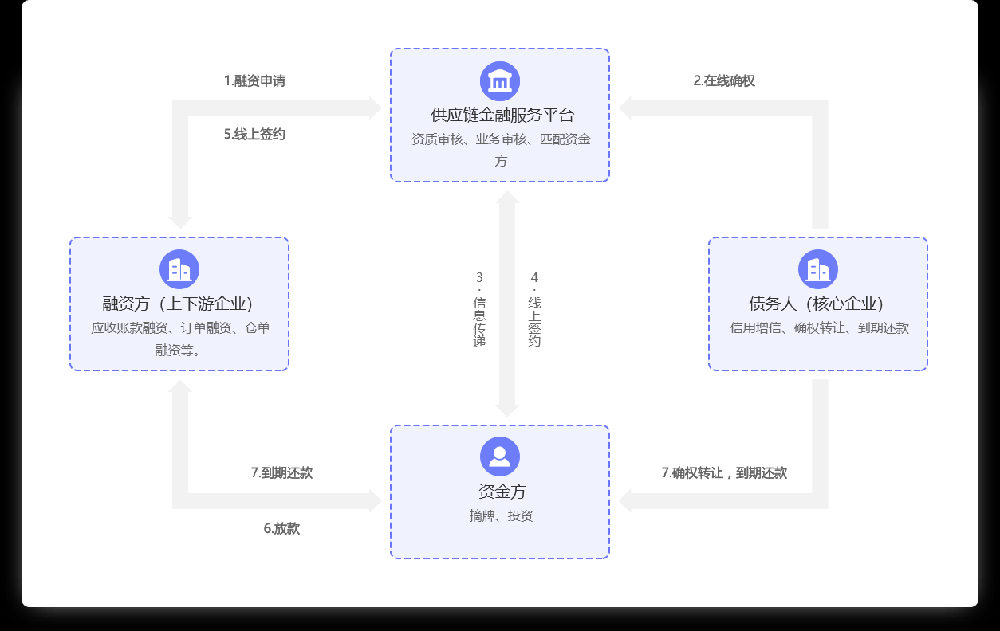

# 金融知识理解


## 个人征信

征信，即信用报告，是一种记录和评估个人或企业的信用历史和信用状况的信息系统。它通常由专业的征信机构收集、处理和存储，并在需要时向授权用户提供。这些信息对于金融机构、银行、租赁公司以及其他需要了解客户信用状况的组织至关重要。

### 征信的主要功能：

1. **记录信用历史**：征信报告详细记录了一个人的贷款、信用卡使用情况、还款历史，以及迟付或不良记录等信息。
2. **评估信用风险**：通过分析个人或企业过去的借贷行为，征信帮助金融机构评估其未来违约的可能性，从而调整授予贷款的规模与条件。
3. **支持决策制定**：金融机构通过征信来决定是否批准贷款申请、确定贷款额度以及设置利率等。此外，也被用作租房合同签订前对租客进行背景审查的一部分。
4. **防范欺诈活动**：监控异常活动，可以及时发现潜在的身份盗用或其他欺诈行为。

### 征信报告包含的信息：

- **个人信息**：如姓名、身份证号码、地址、就业信息等。
- **账户信息**：包括所有活跃和已关闭账户的详细信息，如银行贷款、信用卡账户。
- **还款历史**：展示每个账户每月是否按时付款。
- **公共记录及征收行动**：如破产记录，税务留置权，法院判决。
- **查询记录**：哪些人或机构曾经访问过该报告的信息，以何种目的进行查询。

### 如何获取和维护良好的信用记录：

1. **按时还款**：确保所有账单和债务按时偿还。
2. **降低负债比例**：尽量减少所使用的总可用信用额度。
3. **管理好多个账户**：保持适当数量的开放账户，并避免同时开立太多新账户。
4. **定期检查并纠正错误记录**：可以通过年度获得免费报告并检查其中错误，以便及时纠正不实信息。

### 常见征信机构：

全球知名的征信机构有埃克斯电话(Experian)、益博睿(Equifax) 和TransUnion。在中国，比较著名的是央行下属的中国人民银行征信中心，同时也有私人公司如芝麻信用（蚂蚁金服旗下）参与市场化征信服务。

理解征信的重要性不仅能够帮助个人更好地管理自己的财务健康，也能让企业做出更为明智和安全的商业决策。同时，它也是推动整个经济体系稳定运转的重要一环。

## 企业征信

针对企业的征信称为企业信用报告或商业信用报告。与个人征信类似，企业征信也涉及收集、整理和展示企业在金融及商业活动中的信用记录。然而，由于企业的性质不同于个人，其征信内容和用途也有所区别。

### 企业征信的主要功能：

1. **评估信用风险**：帮助银行、投资者和供应商评估一家企业的信用风险，从而决定是否进行贷款、投资或者合作。
2. **支持商业决策**：通过了解潜在或现有客户的财务健康状况，企业可以更好地作出放贷、合作以及合同谈判等决策。
3. **增强透明度和信誉**：良好的信用记录能够提升企业在市场上的信誉，有助于吸引投资和获取更优越的融资条件。
4. **监控市场风险**：连续追踪交易伙伴或竞争对手的财务动态，以便及时调整经营策略。

### 企业征信报告包含的信息：

- **基本信息**：包括公司注册信息、法定代表人信息、股东结构等。
- **财务信息**：如年度财务报表、盈利能力分析、资本结构分析等。
- **还款记录和负债情况**：公司历史上各类贷款及其还款情况。
- **公共记录**：涉及法律诉讼、破产申请、税务留置权等公开文件。
- **供应商与客户关系信息**：关于该公司与主要供应商及客户之间交易关系的信息。
- **行业与市场分析**（可选）：一些高级报告可能会提供行业整体表现的数据以及对此公司在行业中地位的分析。

### 常见的企业征信机构：

许多国家都有专门从事商业征信服务的机构。国际知名者如邓白氏（Dun & Bradstreet）、Equifax商用服务，以及 Experian 商业服务。在中国也存在类似机构，包括中国人民银行下属的征信中心，以及其他第三方商业数据平台如企查查和天眼查等，它们提供关于公司的公开工商数据与评级服务。

### 如何维持良好的企业信用：

1. **保持良好的财务管理和偿债能力**，确保按时支付供应商账单和贷款。
2. **规范法律合规操作**，避免出现法律纠纷或被强制执行事件。
3. **透明的信息披露和沟通策略**，保持透明以建立市场上的信任感。
4. **维护重要客户与供应商关系**，保护并增强业务网络之稳定性与声誉积累。

通过利用企业征信系统，不仅传统金融机构能做出明智且低风险决策，小型初创公司也能更有效地控制自己的发展路径，并努力提升自己的信誉评分以赢得更多商业机会。

## 供应链金融企业运营流程

在供应链管理和企业运营中，这一流程描述了从合同签订到最终付款的典型业务操作步骤。以下是对每个阶段的详细解释：

1. **合同**：
   - 在这个阶段，买卖双方就产品或服务的具体条款达成协议。合同详细说明了双方的权利和义务，包括产品规格、数量、价格、交货时间、支付条件及其他相关法律条款。
2. **订单**：
   - 一旦合同达成并签署，买方将根据其内部需求生成采购订单（PO），向卖方正式下单。这一环节包括订单确认及必要的信息核对，以确保双方清楚此次交易的细节。
3. **发货**：
   - 卖方准备并发送订单中列明的货物。在此过程中，可能会涉及物流安排和运输文档（如提单）准备。卖方需确保按照约定交付质量合格且完好的商品。
4. **收货**：
   - 买方收到货物后，应进行验收以核实货物是否符合订单要求。这可能包括检查物品数量、质量，以及记录任何损坏或不符情况，如有问题需要及时反馈给卖方。
5. **结算**：
   - 结算通常是指计算应付账款金额，并为付款做准备。这一步骤涉及对照发票与实际收获商品间的差异，对应的解决方案和必要调整。如果提前约定好的，有时这一步也会验证折扣或补偿条款。
6. **发票**：
   - 卖方向买方开具发票，用于请求付款。该发票通常包含已提供商品或服务的详细列表、总金额以及支付期限等信息。
7. **记账**：
   - 在收到和接受发票后，买方将费用录入其财务系统进行处理和追踪。这一过程保证所有交易都被准确记录，并为公司财报提供支持。
8. **付账**：
   - 最后的步骤是实际进行付款。在公司内部完成必要审批后，财务部门依据已经审核过的发票进行支付。这可能通过银行转账、电汇支票等等来实现，完成整个商业交易周期。

这种流程确保了企业在采购和供销活动中的规范操作，提高效率并减少错误风险，同时也能帮助各方更好地管理资金流动并保持良好合作关系。




## 采购订单

订单的表现形式通常是一份详细的文件或电子记录，称为采购订单（Purchase Order, PO）。这份文件包含了买方向卖方正式请求购买特定商品或服务的详情。以下是一个典型采购订单中可能包含的关键信息：

1. **采购订单编号**：
   - 这是一个唯一标识符，用于追踪和管理订单。
2. **供应商信息**：
   - 包括卖方或供应商的名称、地址、联系方式，以及可能的供应商代码。
3. **买方信息**：
   - 包括购买公司的名称、地址、联系人及其相关部门的信息。
4. **日期**：
   - 订单发出的具体日期，以及预期交货日期。
5. **项目明细**：
   - 对每种商品或服务的详细说明，包括：
     - 产品名称或描述
     - 型号或物料编号
     - 数量
     - 单位价格
     - 总金额
6. **税费和折扣**：
   - 涉及增值税、销售税等相关费用以及任何适用的折扣信息。
7. **运输条款**：
   - 描述交付方式（例如，FOB，CIF等）以及责任划分（谁负责运输费用和风险）。
8. **支付条款**：
   - 明确付款方式和期限，例如支付到银行账户的信息、信用条件如30天账期等。
9. **附加条款与条件**：
   - 关于退货政策，担保声明以及法律与合规方面的重要条款。
10. **签署部分**（如果需要）：
    - 一些情况下，尤其是在纸质文档中，可能需要买方经理或者授权人员的签名确认此订单生效。

### 示例采购订单格式：

```
-------------------------------------------------------
                  PURCHASE ORDER

PO Number: 12345                       Date: YYYY-MM-DD

Supplier:
ABC Supplies Co.
123 Supplier Lane
City, State, ZIP
Contact: John Smith
Phone: (123) 456-7890

Buyer:
XYZ Industries
789 Buyer Avenue
City, State, ZIP
Contact: Jane Doe
Phone: (987) 654-3210

-------------------------------------------------------
ITEMS:

Description                    Model #      Qty     Unit Price     Total Price 
----------------------------------------------------------------------------------
Widget A                      WDG-A123      100        $10          $1000
Gadget B                      GDT-B456       50        $20          $1000

Subtotal:                                                  $2000   
Tax (5%):                                                   $100    
Total:                                                     $2100   

Shipping Terms: FOB Destination 
Payment Terms: Net 30 Days 

Additional Notes:
- Include warranty information with shipment.
-------------------------------------------------------

Authorized Signature: _________________________  
Date: _______________
-------------------------------------------------------
```

这样一份详细、标准化并且清晰的采购订单能够极大地减少误解，提高交易顺利进行，并在必要时提供法律依据。

## 融资活动

在金融活动中，存在着订单融资、存货融资、应收账款融资、票据融资等情况，请参考前面的活动流程来介绍这几种情况。在金融活动中，不同类型的融资方式可帮助企业优化现金流管理和资本运作。以下是订单融资、存货融资、应收账款融资及票据融资结合前面流程的详细介绍：

1. **订单融资（Purchase Order Financing）**：
   - **概念**：订单融资是一种借贷安排，企业可以基于已确认的客户订单获得资金支持。金融机构根据企业手中的采购订单提供贷款，以支持其采购原材料或生产商品。
   - **应用场景**：当企业接到了大量或重要的客户订单，但由于自身缺乏足够流动资金来完成生产或履行合同时，可以寻求订单融资。
   - **结合流程**：这通常介入于“合同”与“发货”之间。当合同签订后但在实际履约之前，企业可通过提交采购订单申请银行或金融机构进行投标获得所需营运资金。
2. **存货融资（Inventory Financing）**：
   - **概念**：存货融资是利用库存作为抵押物获取贷款的一种方法。金融机构以公司持有的库存品为抵押品，在其市场价值范围内放款。
   - **应用场景**：适用于那些虽然拥有庞大而稳定的库存但短期内需要资金周转的企业，如零售业或者制造业。
   - **结合流程**：此类融资集中在“存货管理”阶段，即在“发货”和“收货”过程间，当库存形成而未变现情况下，帮助转换成流动资金以支持其他运营需求。
3. **应收账款融资（Accounts Receivable Financing）**：
   - **概念**：这是通过将公司的应收账款转让给金融机构从而提前获得现金形式的一种贷款产品。通常采用贴现方式，提前回笼部分未来即将到期而尚未支付的销售款项。
   - **应用场景**：普遍适用于拥有良好信用客户基础且经常性销售账期较长导致资金压力显著增加的行业，如B2B服务或制造业务。
   - **结合流程**：在“结算”和“发票”阶段之后，卖方可凭这些仍待付款的销售信息向银行打包出售，以改善现金流情况。
4. **票据融资（Bill Financing）**：
   - **概念**：票据融资本质上指的是针对未到期商业汇票进行贴现或质押，以筹集短期资金。这些票据包括承兑汇票、商业本票等，由银行承兑担保具有更高可靠性。
   - **应用场景**：适合使用商业信用开展交易且持有大量短期成熟度商业单据但急需追加营运现金投入的小微型企业或者贸易公司。
   - **结合流程**：主要发生在“发票”和“记账”环节，用于对账单产生预见性财务规划，通过展出并按一定比例折价方式交换立刻生效的资产。

每一种以上提到的融资方法都有助于降低运营周期中的现金流压力，并为企业提供了灵活且多样化的选择。然而不同公司及行业特征使得适用情境各异，需要根据具体条件综合考量合理设计和实施相应方案以确保其最大效益。

## 金融机构在这个过程中，提供各种融资的目的是什么，获得什么收益

金融机构在提供各种融资服务时，其主要目的和收益包括：

### 目的

1. **支持经济活动**：
   - 通过为企业提供资金支持，金融机构帮助推动生产和消费的持续进行，从而促进整体经济的发展。
2. **客户关系管理**：
   - 为现有客户提供更全面的解决方案，以保持并加强与客户的长期合作关系，增加客户黏性。
3. **市场拓展**：
   - 通过多样化的融资产品吸引不同行业和规模的企业，扩大自身市场份额。
4. **风险分散**：
   - 通过向多个行业、不同类型企业及各类资产（如库存、应收账款、票据）发放贷款，金融机构能够有效分散其投资组合中的潜在风险。
5. **创新产品开发**：
   - 在竞争激烈的金融市场中，不断推出新的融资工具可以使金融机构立于领先位置，在变化中适应并满足动态市场需求。

### 收益

1. **利息收入**：
   - 融资过程中，通过贷款或信用额度所取得的利息是金融机构获得的重要收入来源之一。不同类型融资可能设定不同利率以反映相应风险水平。
2. **服务费及手续费收入**：
   - 除了直接的借贷利息外，通常还可能收取附加费用，比如安排费、管理费或其它专项财务顾问咨询费用等。
3. **增值业务机会**：
   - 随着合作关系深化，会产生更多交叉销售机会，例如保险、现金管理、支付处理等其他相关业务，进一步拓宽盈利渠道。
4. **资产控制和流动性管理**：
   - 由于许多这种形式下的融资涉及担保品（如应收账款或存货），这为银行创造了一种在默认情况下掌控这些关键商业资产的方法，从而优化其内部风控体系及资本配置策略。
5. **品牌声誉及市场领导地位增强**：
   - 持续参与到支持商业运行之中且成功案例越多，他们也能因此塑造一个稳健、有资源、有能力解决复杂挑战者形象，提高市场影响力和公信度，并吸引未来更多高质量客户群体加盟其服务网络。

通过合理设计且广泛应用于实际交易中的多元化融资工具组合，金融机构不仅实现了营收增长，同时也能建立一种可持续性的竞争优势，使整个生态链上下游方都能共同受益其中。这种共赢关系，无论对单个企业还是整个产业来说，都产生了积极作用。

## 企业为什么需要融资活动

企业在其运营和成长过程中，会面临许多需要额外资金支持的场景。融资活动能够帮助企业解决这些特定问题和挑战。以下是企业常常需要融资活动的原因：

1. **现金流管理**：
   - 企业往往需要更好地管理营运资金，尤其是在账期较长时（例如，应收账款结算周期较长），通过融资可以缓解短期资金紧张，保持正常的经营活动。
2. **库存采购**：
   - 当企业需要大量采购原材料或商品以满足生产或销售高峰需求时，临时性融资能帮助它们迅速行动，而无需牺牲长期储备或影响其它业务线。
3. **订单履行**：
   - 在接到大订单或重要客户请求后，可能因缺乏足够资金立即启动生产而寻求订单融资，以便及时按质量与数量要求完成交付。
4. **扩大产能和市场份额**：
   - 为了加速增长并抓住市场机会，企业可能需要增加生产能力、投资新设备或者拓展新的营销渠道，这通常需要额外资本投入。
5. **研发和创新投资**：
   - 对于技术驱动型公司，通过融资来推动研发项目或创新计划是保持市场竞争力并创造未来价值的重要方式之一。
6. **风险管理和不确定性应对**：
   - 在面对季节性波动、大宗商品价格波动或经济环境变化等不可预测因素时，获得金融机构支持可以提供一种保障机制以及灵活调整空间。
7. **债务再融资与结构优化**：
   - 有时候企业会选择借新债来偿还高息旧贷或者重塑自身债务架构，以降低财务成本与改善整体资产负债表表现。
8. **增强竞争优势**：
   - 通过获取更多资源，根据行业标准动态调整策略，为购买先进技术、聘请高级人才或者进行品牌推广等形成可持续发展优势奠定基础。

总之，不同类型的融资满足企业在不同阶段出现的各种需求，无论是确保日常运营平稳运行还是实现战略目标跃升，新鲜资本的注入都可能成为关键推动力并提供必要支撑。通过合理利用这些工具，每个企业不仅能更好应对现实挑战，还将拥有更多机会去探索未来潜力及作出明智布局。

## 贴现和质押

在金融活动中，应收账款融资和票据融资中，都提到了贴现和质押，请介绍这两个概念。

贴现和质押是两种常见的金融工具，广泛应用于企业融资过程中，如应收账款融资和票据融资。它们各自有不同的机制和应用场景：

### 贴现（Discounting）

**概念**：

- 贴现是指将未来应收的票据或账款，在到期日之前出售给银行或金融机构，并获取即期现金的一种方式。
- 金融机构会扣除一定比例的费用，这个费用依据实际票面金额、持有期及风险评估来决定。

**应用场景**：

- **商票贴现**：公司拥有未到期商业汇票，可以通过银行进行贴现获得现金流。例如，一家公司收到客户的承兑汇票，但需要立即用资金来支付供应商账单，于是选择贴现这张汇票。
- **应收账款贴现**：适用于企业希望尽快转化成现金，以加速营运资金周转或者投资新的项目。

**利弊**：

- *优势*：快速获取流动性，有助于改善现金流管理和财务计划。
- *劣势*：因要付出一定的手续费或折扣率，所以实际得到金额可能少于原始价值。

### 质押（Pledge）

**概念**：

- 质押是一种担保贷款形式，指借款人为获得资金，将某些资产如应收账款、存货或有形资产作为抵押品提供给银行等金融机构。若无法按时还贷，借款方需交由该质物所有权予以偿还责任。

**应用场景**：

- 企业可以利用手头持有的不动产、存货甚至无形资产（如专利）申请贷款，从而进行短期采购、运营维护或者紧急支出需求。

**利弊**：

- *优势*：能够在不出售核心资产情况下获得所需资金；可能影响小于其他类型债务操作且仍保持对这些财产权益部分控制权。
- *劣势*：如果借款人违约，将失去质押物相关权益并且在市场供需变化中可能遭受减值损失。

总结来说，贴现和质押分别代表了基于未来收入预期提前获取现金以及将已有资产作为担保获取贷款这两大主导思路，使得企业能更灵活地处理临时财务困难，并为长远规划做好准备。合适地运用这些工具，不仅能够提高资金使用效率，还可促进业务增长与稳定经营发展。

## 供应链金融平台机构关系

在供应链金融平台这个系统中，存在如下几个机构：供应链金融平台，负责资质审核，业务审核，匹配资金方；债务人（核心企业）负责信用增信，确权转让，到期还款；资方，负责摘牌和投资。融资方（上下游企业），负责应收帐款融资、订单融资、仓单融资等。请你详细介绍一下这几个机构及之间的关系。




在供应链金融平台中，各个机构扮演着不同的角色，它们之间相互协作以实现有效的融资和投资流程。以下是对每个机构及其关系的详细介绍：

1. **供应链金融平台**：
   - 主要功能：该平台负责整体协调和监管，包括资质审核、业务审核，以及匹配合适的资金方（即资方）给需要资金的企业。
   - 与其他机构的关系：
     - 与债务人合作，确保他们提供准确的信用增信信息，并进行确权转让，以便为融资活动提供支持。
     - 与资方互动，使其能根据业务需求选择合适的投资方案，同时进行绩效评估。
     - 为融资方（上下游企业）提供支持，通过审核其请求并匹配合适的资金来源。
2. **债务人（核心企业）**：
   - 主要功能：作为核心企业，债务人通过信用增信来提高整个供应链条上的信用等级。他们负责生成应收账款或类似资产，并承诺到期还款。
   - 与其他机构的关系：
     - 提供增信和确权转让给供应链金融平台，从而增强上下游企业融资能力。
     - 确保按时履行还款义务，以确保资方投资安全。
3. **资方**：
   - 主要功能：作为资金提供者，他们通过摘牌（即选择特定投资机会）并向合适借款项目进行投资，这些项目通常是在借款人的背景下被定义和确认过的。
   - 与其他机构的关系：
     - 从供应链金融平台获取经过审核后的项目清单，然后决定哪个项目符合自己的投资标准。
     - 在投资后，与债务人保持沟通，以跟踪债务偿还进度。
4. **融资方（上下游企业）**：
   - 主要功能：这些企业位于供应链两端，通常需要获得融资以维持运营流动性，比如通过应收账款、订单或仓单进行融资。
   - 与其他机构的关系：
     - 必须与供应链金融平台合作以提交申请并获得审批，然后匹配到合适的资方来提供所需资金。
     - 借助于核心企业（债务人）的增信行为，他们能够获得更优惠或者更可靠的贷款条件。

以上各个角色紧密联系，共同协作实现供应链金融价值最大化，有效提升了整个供应链条上的资本流动性，从而有利于所有参与者的发展与稳定。

## 在这个系统中核心企业和上下游企业分别代表什么，为什么说融资方是处在供应链金融的两端

在供应链金融系统中，核心企业和上下游企业有各自的角色与定位：

### 核心企业

- **定义**：核心企业通常是供应链中的大中型企业，在其行业或市场内具有较强的影响力或议价能力。这些企业常常是供应链的中心节点，其信用情况能够对整个供应链产生重要影响。
- **作用**：作为债务人，核心企业通过提供信用增信来支持上下游企业的融资。它们可以利用自身较好的信用状况，为其合作的上下游小微企业提供信誉担保，从而帮助这些小微企业更容易地获取融资。

### 上下游企业（融资方）

- 定义

  ：这些是与核心企业进行交易的小型或中型企业，通常分为上游（如供应商）和下游（如经销商、零售商）。

  - **上游企业**：例如原材料提供商，他们向核心企业出售商品或服务。
  - **下游企业**：例如产品销售商，他们进一步将核心企业的产品推向市场。

- **作用**：作为融资方，上下游企业通常需要资金以维持运营，例如采购原材料、生产加工或扩展销售网络。由于自身规模较小以及独立信用等级可能较低，直接从传统金融机构获得贷款可能具有挑战性，因此他们借助供应链金融平台，通过应收账款融资、订单融资等方式获取资金。

### 为什么说融资方处于供应链金融的两端？

1. **上游位置**：
   - 上游供应商需要确保持续供货给核心企业，因此在等待应收款期间可能面临现金流压力，需要提前获得资金支持，这时候就成了"应收账款"的发起者。
2. **下游位置**：
   - 下游购买者或者经销商为了扩大销售网络或者备货，也会遇到资金短缺问题，他们可能需要通过预付账款或其他方式来锁定库存。

因此，以上说明了为什么在供应链金融系统中，上下游的小型和中型公司被看作是“融资方”，因为它们位于供应链两端，并且都具备潜在的资金需求，而这正是供应链金融服务所瞄准缓解的问题。

## 在这个平台中债务人和融资方和资金方三者的关系

在供应链金融平台中，债务人、融资方和资金方之间的关系是相互依存且协作的，每一方都有特定的角色和职责，共同促成了供应链金融活动的有效运作。

### 债务人（核心企业）

1. **与融资方的关系**：
   - 核心企业作为主要客户或合作伙伴，对上下游融资方提供信用支持。这种支持通常表现为通过其良好的信用等级为融资方提供增信，使得这些小型企业更容易获得融资。
   - 核心企业负责确权转让，即确认该应收账款是真实合法的，并愿意对这些账款责任进行担保，这提高了融资方在平台上进行交易和获取资金的可信度。
2. **与资金方的关系**：
   - 债务人在整个交易过程中起到桥梁作用，通过其信誉和业务稳定性来吸引资金方进行投资。
   - 在债务人确认应付未支付账款后，资金方向其提供必要的流动性支持，而这种支持是基于债务人的还款能力和商业信誉。

### 融资方（上下游企业）

1. **与债务人的关系**：
   - 融资方往往需要依赖核心企业提供的订单或销售合同来生成应收账款，进而通过这些帐款开展融资。
   - 上下游企业通过利用核心企业提供的增信措施，提高自身贷款成功率并可能获得更优质的贷款条件。
2. **与资金方的关系**：
   - 作为借款主体，融资方向资金方提出贷款申请，利用已确认过风险的小额短期资产（如应收账款）做抵押以换取所需流动性。
   - 必须确保按时履行还款义务，以维护自己及整个产业链上的信用声誉，从而持续获得未来更多的融资机会。

### 资金方

1. **与债务人的关系**：
   - 基于债务人的确权信息及其良好信用评估结果，决定是否摘牌某个项目并投入资本。
   - 投资安全基于债务人的偿还能力，因此会关注其财务稳定性、市场前景等因素。
2. **与融资方的关系**：
   - 扮演资本提供者角色，需要评估每笔贷款请求背后的风险及潜在收益，并根据项目情况合理分配投资额度。
   - 期待从他们所投项目中获得利息收益，同时密切监控其还贷动态以降低逾期风险。

总结而言，这三者形成一个紧密联系的问题解决网络，结合各自优势实现了供应链条上高效、安全且灵活地配置金融资源。

## 为什么我感觉：而债务人还给的是上下游企业，融资方到期还给的是资金方，

你的理解是正确的，但需要稍作澄清。债务人和融资方确实在不同背景下进行还款，以下是对这两者关系的详细解释：

### 债务人与上下游企业（融资方）

- 债务人（核心企业）与上下游企业之间的应付/应收关系

  ：

  - 在供应链中，债务人一般是核心企业，这些企业会向上游供应商采购物料或产品，而这些供应商可以是融资方。
  - 上游企业向核心企业提供商品或服务后，会产生应收账款（融资工具之一），而核心企业此时则有对应的应付款项。
  - 当应付款到期时，核心企业需要支付给上游供应商。这意味着债务人在履行其“供货合同”中的付款责任。

### 融资方向资金方

- 融资方向资金方偿还贷款

  ：

  - 上下游的中小型企业作为融资方，通过将其拥有的、来自于与核心企业交易所生成的应收账款用作抵押，从金融平台或其他资金提供者那里获得短期贷款。
  - 这些贷款通常用于解决流动性问题，比如提前支付进货成本或者员工工资等运营费用。
  - 融资方必须在约定期限内将贷款本金及利息归还给资方，即实现对资金使用后的“金融借贷”偿还义务。

因此，可以总结为：

- **债务人（核心企业）主要是在商品或服务交易框架内完成对上下游合作伙伴（如上游供应商）的账款支付**。
- **融资方则是在金融交易框架内，与独立第三方（即资金提供者）存在借贷关系，需要按期偿还通过平台获得的流动性支持**。

这种模式使得上下游的小微企业能够更有效地管理现金流，同时也增强了整个供应链体系内的信用和资本效率。

## 债务人通常是核心企业，它们主要负责对资方进行还款。当资金方（如银行、投资机构）基于应收账款或其他增信措施向上下游企业提供资金时，债务人的责任是确保其承诺的付款如期进行。 这句话是不是有问题

这句话确实可能会引发一些混淆，因此我来澄清并解释其中的逻辑：

1. **债务人（核心企业）与资方之间的关系**：
   - 在供应链金融中，债务人通常是核心企业。这个角色主要负责为上下游企业提供信用增信，从而使上游供应商或下游销售商能够利用该应收账款向资金方进行融资。
   - 核心企业并不是直接从资金方借钱，而是通过其良好的信用评级来确保上下游企业可以更容易地在金融市场中获得贷款。
2. **谁实际向资方还款**：
   - 实际上从资金方（银行、投资机构）获取贷款的是上下游企业。这些融资方利用他们拥有的应收账款作为抵押物来得到短期负债支持。
   - 这些融资方承担着向资金方偿还贷款本金及利息的义务，而债务人的角色则更多地体现在以自身信用为其应付款担保，以便协助上下游供应商取得更低成本、更大额度的融资。
3. **责任区别**：
   - 债务人在此链条中的关键责任是及时支付其合同中对应外部合作伙伴（如上游供应商）的应付款项，这样就保障了应收账款的真实性和可回笼性，让融资方向资方兑付变得稳妥。

总结来说，债务人并不是直接对资方进行还款；相反，是在保障整个交易流转顺畅、提高关联小微企业信用级别上扮演重要作用。具体到还款，则是那些通过平台获得资金支持的上下游企业直接向金融提供者履行义务。这也说明了为何这一系统实际上增强了产业链整体流动性的有效性。

## 作为债务人需要在线确权和确权转让，请分别介绍这两个概念

在供应链金融中，“在线确权”和“确权转让”是两个关键概念，它们涉及到应收账款的管理和处理，确保它们能被有效地用于融资目的。以下是对这两个概念的详细介绍：

### 在线确权

- **定义**：在线确权是指债务人（通常是核心企业）在一个数字化平台上确认应收账款的合法性和真实性。这一过程需要债务人核实并认可由其上下游企业生成的应收账款。
- **目的**：通过在线确权，核心企业承认这些应收账款是真正存在且有效的，有助于增强融资方对外部投资者或资金提供者的信用可靠性。
- **流程**：
  - 核心企业会接收到来自供应商（上游企业）的发票或订单请求。
  - 在平台上，核心企业核实这些文件与真实交易情况相符。
  - 确认后，系统记录下该笔债务已被核心企业认可，这就为后续融资操作提供了基础保障。

### 确权转让

- **定义**：确权转让涉及将经过在线确权后的应收账款权益从原持有人（通常是供应商或下游销售商）转移给其他方，比如银行或其他资金提供者。
- **目的**：目标在于将财产所有权从一个法人实体转换至另一个，从而使得这些帐款能够作为可抵押资产来获取贷款。
- **流程**：
  - 一旦应收账款获得核心企业的确认，上下游企业可以选择将这一权益转让给相关金融机构。
  - 债务人的增信行为帮助提升了申请贷款时整体项目的可信度，因此金融机构愿意以此作为贷款抵押物为融资方向其提供流动性支持。
  - 转让成功后，资金方成为新的主张支付者，并依赖于原有合同规定获取偿还利益。

综述，通过以上环节，应收账款不仅仅是商业往来中的货币需求，还能够大幅提高小微企业维护运营流动性的便利性，同时优化整个供应链上的资本流动效率。债务人在其中起到促进、验证以及担保的重要作用，以确保供应链各个节点的信息透明与资金安全。

