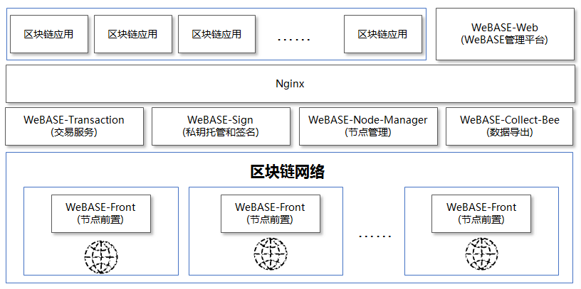
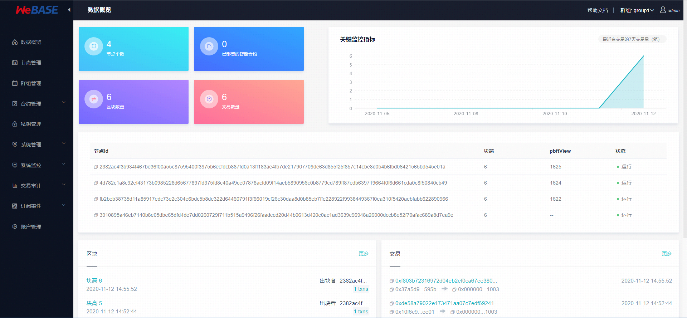

# 智能合约平台WeBase


## WeBase概览

微众银行开源的自研区块链中间件平台——[WeBankBlockchain WeBASE(WeBank Blockchain Application Software Extension, 简称WBC-WeBASE)](https://webasedoc.readthedocs.io/zh_CN/lab/) 是区块链应用和FISCO BCOS节点之间搭建的中间件平台。WBC-WeBASE屏蔽了区块链底层的复杂度，降低区块链使用的门槛，大幅提高区块链应用的开发效率，包含节点前置、节点管理、交易链路，数据导出，Web管理平台等子系统。用户可以根据业务所需，选择子系统进行部署，可以进一步体验丰富交互的体验、可视化智能合约开发环境IDE。

WBC-WeBASE管理平台是由四个WBC-WeBASE子系统组成的一套管理FISCO-BCOS联盟链的工具集。WBC-WeBASE lab版本(lab分支)已适配FISCO BCOS 3.X版本，详细了解可以参考[《WBC-WeBASE管理平台使用手册》](https://webasedoc.readthedocs.io/zh_CN/lab/) 。

### 1. 主要功能

1. 区块链数据概览
2. 节点管理
3. 合约管理
4. 私钥管理
5. 系统管理
6. 系统监控
7. 交易审计
8. 账号管理

所以这里面已经包含了区块链数据，节点管理，合约管理，私钥管理，系统监控，交易审计，账号管理。所以webase不是什么合约的东西，而是一个区块链管理工具。所以之前设想的在金融平台加入的功能，完全可以在这里进行加入。包括运营的一些工作，也重点在这里了。

### 2. 什么是WeBASE

WeBASE（WeBank Blockchain Application Software Extension） 是在区块链应用和FISCO-BCOS节点之间搭建的一套通用组件。围绕交易、合约、密钥管理，数据，可视化管理来设计各个模块，开发者可以根据业务所需，选择子系统进行部署。WeBASE屏蔽了区块链底层的复杂度，降低开发者的门槛，大幅提高区块链应用的开发效率，包含节点前置、节点管理、交易链路，数据导出，Web管理平台等子系统。



### 3. 各子系统简介

- **节点前置服务**

  集成FISCO BCOS JavaSDK，提供RESTful风格的接口，客户端可以使用http的形式和节点进行交互，内置内存数据库，采集节点健康度数据。内置web控制台，实现节点的可视化操作。这个是属于区块链网络的一部分，适合区块链节点进行绑定的。

- **节点管理服务**

  处理前端页面所有web请求，管理各个节点的状态，管理链上所有智能合约，对区块链的数据进行统计、分析，对异常交易的审计，私钥管理等。

* **WeBASE管理平台**

  可视化操作平台，可基于此平台查看节点信息，开发智能合约等。

* **私钥托管和签名服务**

  托管用户私钥，提供云端签名。

## 2. 节点前置服务

WeBASE-Front是和FISCO-BCOS节点配合使用的一个子系统。此分支支持FISCO-BCOS 2.0以上版本，集成java-sdk，对接口进行了封装，可通过HTTP请求和节点进行通信。另外，具备可视化控制台，可以在控制台上开发智能合约，部署合约和发送交易，并查看交易和区块详情。还可以管理私钥，对节点健康度进行监控和统计。

WeBASE-Front使用方式有以下三种：

1、单独部署作为独立控制台使用，请参考[部署说明](https://webasedoc.readthedocs.io/zh-cn/lab/docs/WeBASE-Front/install.html)。

2、结合[WeBASE-Node-Manager](https://github.com/WeBankBlockchain/WeBASE-Node-Manager)和[WeBASE-Web](https://github.com/WeBankBlockchain/WeBASE-Web)服务一起部署使用，请参考[WeBASE安装部署](https://webasedoc.readthedocs.io/zh-cn/lab/docs/WeBASE-Install/index.html)。

3、结合[WeBASE-Sign](https://github.com/WeBankBlockchain/WeBASE-Sign)服务一起部署使用，调用WeBASE-Sign进行数据签名，再发送上链。此方式在方式1的基础上再部署WeBASE-Sign服务，然后需调用合约部署（结合WeBASE-Sign）接口、交易处理（结合WeBASE-Sign）接口进行合约部署和调用（需要在yml中配置sign的地址）。

### 服务安装


1. 安装java环境

   我们之前其实安装过java，但是由于没有正式使用，所以需要先配置一下。首先找到java的安装目录。

   ```bash
     $ ls /usr/lib/jvm/
   ```

   通常，你可能会看到类似于 `java-11-openjdk-amd64` 或 `java-8-openjdk-amd64` 的目录名称。

   编辑~/.bashrc，增加一下的内容

   ```
   export JAVA_HOME=/usr/lib/jvm/java-11-openjdk-amd64
   export PATH=$PATH:$JAVA_HOME/bin
   ```

   让修改生效

   ```bash
   $ source ~/.bashrc
   ```

   

2. 下载安装包

   ```bash
   wget https://github.com/WeBankBlockchain/WeBASELargeFiles/releases/download/v3.1.1/webase-front.zip
   
   # 网络访问失败，则可以尝试直接git clone WeBASE-Front的仓库，构建方法可参考节点前置部署文档
   git clone -b master-3.0 https://github.com/WeBankBlockchain/WeBASE-Front.git
   # 若因网络问题导致长时间下载失败，可尝试以下命令
   git clone -b master-3.0 https://gitee.com/WeBank/WeBASE-Front.git
   ```

   

3. 解压

   ```bash
   unzip webase-front.zip && cd webase-front
   ```

   

4. 拷贝sdk证书文件（build_chain的时候生成的）

   将节点所在目录`nodes/${ip}/sdk`下的所有文件拷贝到当前`conf`目录，供SDK与节点建立连接时使用

   - 拷贝命令可使用`cp -r nodes/${ip}/sdk/* ./conf/`

   - 证书为以下两种之一：

     非国密：`ca.crt`、`sdk.crt`、`sdk.key`

     国密：`sm_ca.crt`、`sm_sdk.crt`、`sm_sdk.key`、`sm_ensdk.crt`、`sm_ensdk.key`

5. 修改配置

   ```
   vi conf/application.yml
   ```

   

   ```
   sdk:
     useSmSsl: false  # sdk连接节点是否使用国密ssl
     peers: ['127.0.0.1:20200','127.0.0.1:20201'] # 节点ip和rpc端口
   ```

   

6. 服务启停

   返回根目录，服务启停命令：

   ```
   启动： bash start.sh
   停止： bash stop.sh
   检查： bash status.sh 
   ```

   启动成功将出现如下日志：
   ```
   ...
   Application() - main run success...
   ```


### 检查服务日志

日志中若出现报错信息，可根据信息提示判断服务是否异常，也可以参考并根据错误提示或根据[WeBASE-Front常见问题](https://webasedoc.readthedocs.io/zh-cn/lab/docs/WeBASE-Front/appendix.html)进行错误排查

- 如果节点进程**已启用**且端口**已监听**，可跳过本章节
- 如果节点前置异常，如检查不到进程或端口监听，则需要`webase-front/log`中查看日志的错误信息
- 如果检查步骤出现检查不到进程或端口监听等异常，或者前置服务无法访问，可以按以下顺序逐步检查日志：
  - 检查`webase-front/log`中查看节点前置日志的错误信息，如果无错误，且日志最后出现`application run success`字样则代表运行成功
  - 检查`nodes/127.0.0.1/nodeXXX/log`中的节点日志

**查看运行成功日志**：webase-front运行成功后会打印日志`main run success`，可以通过搜索此关键字来确认服务正常运行。

如，检查webase-front日志，其他webase服务可进行类似操作

```
$ cd webase-front
$ grep -B 3 "main run success" log/WeBASE-Front.log
```

输出如下：

```
2020-12-09 15:47:25.355 [main] INFO  ScheduledAnnotationBeanPostProcessor() - No TaskScheduler/ScheduledExecutorService bean found for scheduled processing
2020-12-09 15:47:25.378 [main] INFO  TomcatEmbeddedServletContainer() - Tomcat started on port(s): 5002 (http)
2020-12-09 15:47:25.383 [main] INFO  Application() - Started Application in 6.983 seconds (JVM running for 7.768)
2020-12-09 15:47:25.383 [main] INFO  Application() - main run success...
```

### 访问

访问 http://{deployIP}:{frontPort}/WeBASE-Front，示例：

````
```
http://localhost:5002/WeBASE-Front 
```
````


## 3. 节点管理服务

### 1. 功能说明

WeBASE-Node-Manager可以是处理前端页面所有web请求，管理各个节点的状态，管理链上所有智能合约，对区块链的数据进行统计、分析，对异常交易的审计，私钥管理等，含有如下功能模块：

| 序号 | 模块             | 描述                                             |
| ---- | ---------------- | ------------------------------------------------ |
| 1    | 前置管理模块     | 维护关联WeBASE-Front服务信息                     |
| 2    | 交易信息模块     | 查看交易信息                                     |
| 3    | 帐号管理模块     | 维护系统登录账号信息                             |
| 4    | 区块管理模块     | 查看区块信息                                     |
| 5    | 合约管理模块     | 维护合约信息                                     |
| 6    | 服务器监控       | 监控节点服务器状态与邮件告警                     |
| 7    | 审计模块         | 查看异常合约及异常用户信息                       |
| 8    | 群组信息模块     | 查看群组信息                                     |
| 9    | 节点管理模块     | 查看节点信息                                     |
| 10   | 角色管理模块     | 查看系统登录用户的角色信息                       |
| 11   | 用户管理模块     | 维护密钥信息                                     |
| 12   | 合约方法管理模块 | 维护合约abi文件中所包含的的方法信息              |
| 13   | 系统管理模块     | 预编译API，包含权限管理，节点管理，CNS管理等信息 |
| 14   | 证书管理模块     | 查看sdk证书、节点证书等信息                      |
| 15   | 订阅事件模块     | 查看已订阅的链上事件通知信息                     |

安装详情可查看下一章节的[WeBASE-Node-Manager部署说明](https://webasedoc.readthedocs.io/zh-cn/lab/docs/WeBASE-Node-Manager/install.html)

## 4. WBC-WeBASE管理平台

本项目是区块链中间件平台WeBASE管理平台，使用框架`vue-cli`。

支持FISCO-BCOS 3.0以上版本，支持群组和群组切换。具体功能有：

1. **区块链数据概览**，可以查看区块链的节点、区块、交易、合约信息。点击左上角交易信息和区块信息界面，可以跳转到区块或交易信息列表页，交易信息支持input解码和event解码。
2. **节点管理**，可以查看前置列表、节点列表、修改节点共识状态。可以查看链上的所有群组和节点，查看前置所在服务器状态相关信息，管理节点的共识状态。
3. **合约管理**，提供图形化合约IDE、查询已部署合约列表、合约CNS查询以及预编译合约的CRUD功能。编译、部署合约后该合约会被保存。
4. **私钥管理**，管理所有可以发交易的帐号，公钥用户是其他机构的帐号，无法在本机构发交易，可以通过手动绑定和自动同步获取。私钥用户为本机构发交易的用户。
5. **系统管理**，提供权限管理、系统配置管理、证书管理的功能。权限管理可以控制私钥用户的权限范围，证书管理可以查看链的相关证书。
6. **系统监控**，系统监控包含了节点监控、主机监控与异常告警。监控整条链所有机构所有用户发送交易行为，查看是否有异常用户和异常合约，并在异常状态下通过告警邮件通知运维管理员。
7. **交易审计**，主要监控整条链所有机构所有用户发送交易行为，查看是否有异常用户和异常合约。
8. **帐号管理**，只有admin帐号才能查看此功能，可以新增帐号（登录此系统帐号）、修改密码、修改账户邮箱等等。

搭建可参考[一键部署文档](https://webasedoc.readthedocs.io/zh_CN/lab/docs/WeBASE/install.html)。




